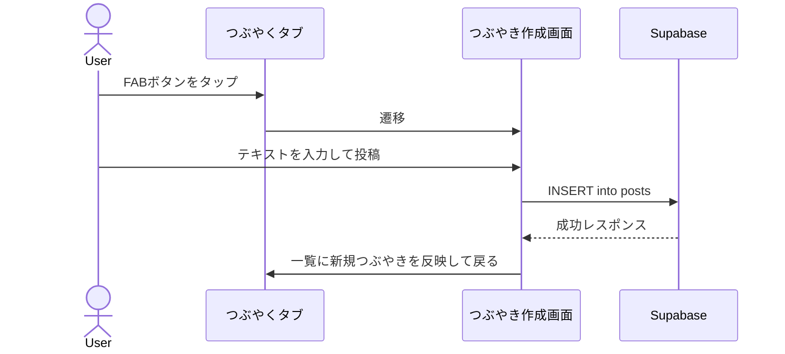
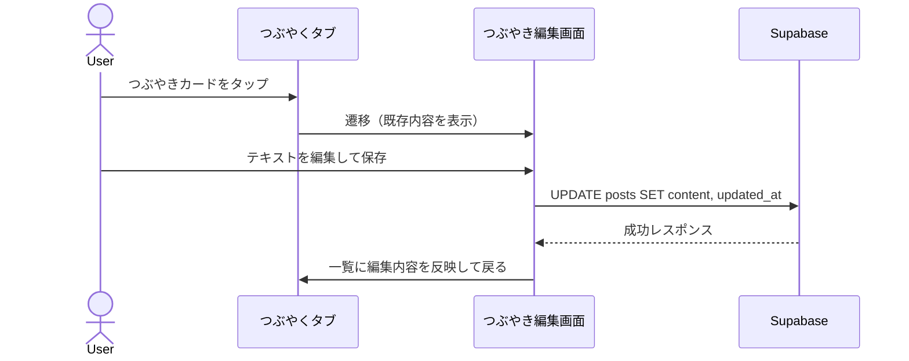
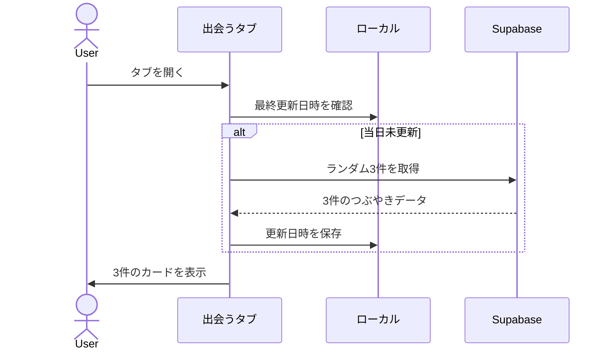
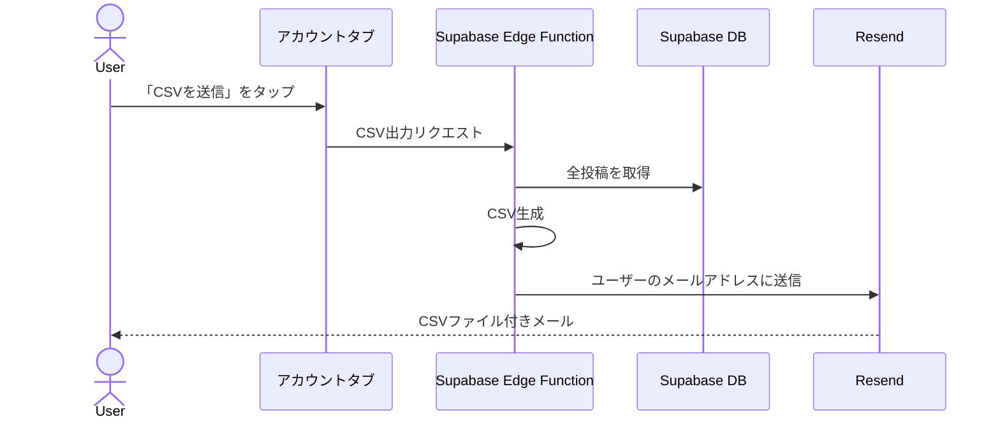

# 01. 要件定義書

## 1. アプリ概要

**Thinkee** は、頭の中を「吐き出す」ことと「過去の自分と出会い直す」ことを繰り返すことで、思考を育てていく支援アプリである。  
SNS ではない。他者への発信を目的とせず、自分の思考との対話だけに特化する。

---

## 2. コアコンセプトと設計哲学

### 2-1. 思考の外在化

人は一日に多くのことを考えるが、そのほとんどは消えていく。Thinkee は「消えかける思考の断片」を書き留める場所である。140文字という制約が書き始める敷居を下げる。整えなくていい。まず吐き出す。

### 2-2. 過去の自分を「他者」として出会い直す

書いたものを自分で読み返すとき、人は無意識に記憶を補完し、当時の文脈を思い出そうとする。しかし「出会う」タブでは、過去のつぶやきがランダムに届く。ユーザーが能動的に選ぶのではなく、届く。

この「届く」という非対称性が重要である。自分が書いたにもかかわらず、どこか他者からのメッセージのように感じられる。今の自分の思考の外側から、宛先を間違えたような何かがやってくる。その誤配こそが、思考を揺さぶる。

> 「あー、そんなこと考えてたんだ」  
> 「今なら別の考えになるな」  
> 「これ、今も変わっていないな」

その驚きや揺さぶりこそが、このアプリが提供したい中核体験である。

### 2-3. ランダム性の意図

ユーザー自身が過去のつぶやきを選べる設計にしなかったのには理由がある。自分で選べば、共感できる・安心できる思考ばかりを選びがちになる。選べないことで初めて、忘れていた自分・驚く自分・反発する自分に出会える。

ランダムに「届く」ことが重要なのは、それが今の自分の意図の外側から来るからだ。意図の外側からやってくるものだけが、今の思考に本当の揺さぶりをかけられる。

### 2-4. 制約としての 140 文字とリズム

140文字は、書き切れる量だ。書いて、投稿して、また書く。このリズムが重要で、ひとつの投稿はそれ自体が小さな達成である。小さな達成を積み重ねることで、ひとつながりの思考が成立していく。

長く書けば、思考は整理されすぎる。整理されすぎた思考は、後で読んだときに「当然そう思うはず」という感覚しか生まない。140文字という制約は、まだ輪郭が定まっていない思考の断片をそのまま保存するために機能する。書ききれなければ、続きを新しいカードに書けばいい。

### 2-5. 引用という「時間を超えた対話」

過去のつぶやきを引用して新しいつぶやきを書く行為は、過去の自分への返答である。引用元と新しいカードが紐づくことで、単なるメモの蓄積ではなく「思考の変化の軌跡」が可視化される。

### 2-6. 完全にプライベートである理由

SNS は、承認やつながりを軸にした場所だ。誰かに見られ、反応される。それ自体は悪いことではないが、人との関係の中だけで生きるゲームになりやすい。Thinkee はそのゲームから距離を置く。

誰にも見られない。何を書いてもいい。孤独に何かを考えていい。そういう場を大切にしたい。

他者の目があるとき、人は思考を「見せるための形」に整える。その時点で、もっとも素朴で重要な部分が失われることが多い。Thinkee は徹底してプライベートな空間であることで、整えられていない思考がそのまま置かれる場所になることを目指す。孤独になれる場所を守ることが、このアプリの根幹にある。

---

## 3. ターゲット・ペルソナ

| 項目 | 内容 |
|------|------|
| ターゲット年代・属性 | 特定しない（全年代・全属性対象） |
| コアバリュー | 「考えを吐き出す場所」と「過去の自分との対話」を手軽に提供する |

---

## 4. 機能要件

### 4-1. 認証機能

認証は **Google OAuth のみ** とする。メールアドレス・パスワード認証およびパスワードリセット機能は提供しない。

| # | 機能 | 優先度 |
|---|------|--------|
| A-1 | Google アカウントによるサインイン / サインアップ | 必須 |
| A-2 | ログアウト | 必須 |
| A-3 | ログイン状態の永続化 | 必須 |

### 4-2. つぶやくタブ機能

頭の中にあるものをリズムよく吐き出す場所。短文をカードとして積み上げていく。

| # | 機能 | 優先度 |
|---|------|--------|
| P-1 | テキスト投稿（カード形式） | 必須 |
| P-2 | 投稿一覧表示（タイムライン形式） | 必須 |
| P-3 | 投稿の並べ替え（新しい順 / 古い順） | 必須 |
| P-4 | キーワード検索 | 必須 |
| P-5 | 投稿の上書き編集（タップして編集） | 必須 |
| P-6 | 投稿の削除 | 必須 |
| P-7 | 投稿の文字数制限（上限 140 文字） | 必須 |
| P-8 | 投稿カードに投稿日時を表示。編集済みの場合は編集日時を小さく併記 | 必須 |
| P-9 | 投稿カードにお気に入りボタンを表示。タップでお気に入り登録 / 解除 | 必須 |
| P-10 | お気に入りした投稿のみ表示するフィルタリング | 必須 |
| P-11 | 投稿作成・編集画面に残り文字数を表示（例: 残り 42 文字） | 必須 |
| P-12 | つぶやきカードに引用ボタンを表示。タップで引用作成画面へ遷移 | 必須 |
| P-13 | 引用つぶやきは引用元カードを埋め込み表示した新しいカードとしてタイムラインに追加される | 必須 |
| P-14 | 引用つぶやきの文字数制限は通常と同じ 140 文字（引用元テキストはカウントに含まない） | 必須 |
| P-15 | 引用元のつぶやきが削除された場合、埋め込み部分に「削除されたつぶやき」と表示する | 必須 |

### 4-3. 出会うタブ機能

過去の自分が書いたつぶやきがランダムに届く。他者となった過去の自分の声が、今の思考に揺さぶりをかける。

| # | 機能 | 優先度 |
|---|------|--------|
| R-1 | 過去の投稿からランダムに 3 件を表示 | 必須 |
| R-2 | 表示内容は 1 日 1 回更新される | 必須 |
| R-3 | 表示された投稿の上書き編集（タップして編集） | 必須 |
| R-4 | 投稿数が 3 件未満の場合は「投稿が少ないです」旨のメッセージのみ表示し、投稿カードは表示しない | 必須 |
| R-5 | 振り返りで表示された投稿カードにもお気に入りボタンを表示 | 必須 |
| R-6 | 出会ったつぶやきを引用してその場で返答できる | 必須 |

### 4-4. アカウントタブ機能

| # | 機能 | 優先度 |
|---|------|--------|
| AC-1 | ユーザー情報の確認（Google アカウント名 / メールアドレス等） | 必須 |
| AC-2 | ログアウト | 必須 |
| AC-3 | 全投稿を CSV 形式でメール送信（Resend を使用） | 必須 |
| AC-4 | アカウント削除 | 必須 |

---

## 5. 非機能要件

| 区分 | 要件 |
|------|------|
| パフォーマンス | 投稿一覧は無限スクロールまたはページネーションで、スムーズにスクロールできること |
| セキュリティ | 他ユーザーのデータにはアクセスできないこと（RLS による制御） |
| オフライン | ネットワーク接続がない場合はアプリを起動・利用できない。接続エラー画面を表示し、操作を受け付けない |
| プラットフォーム | iOS・Android 両対応 |

---

## 6. 主要ユースケース

### UC-1: つぶやく

### UC-2: つぶやきを編集する

### UC-3: 過去の自分と出会う

### UC-4: CSV をメールで受け取る

