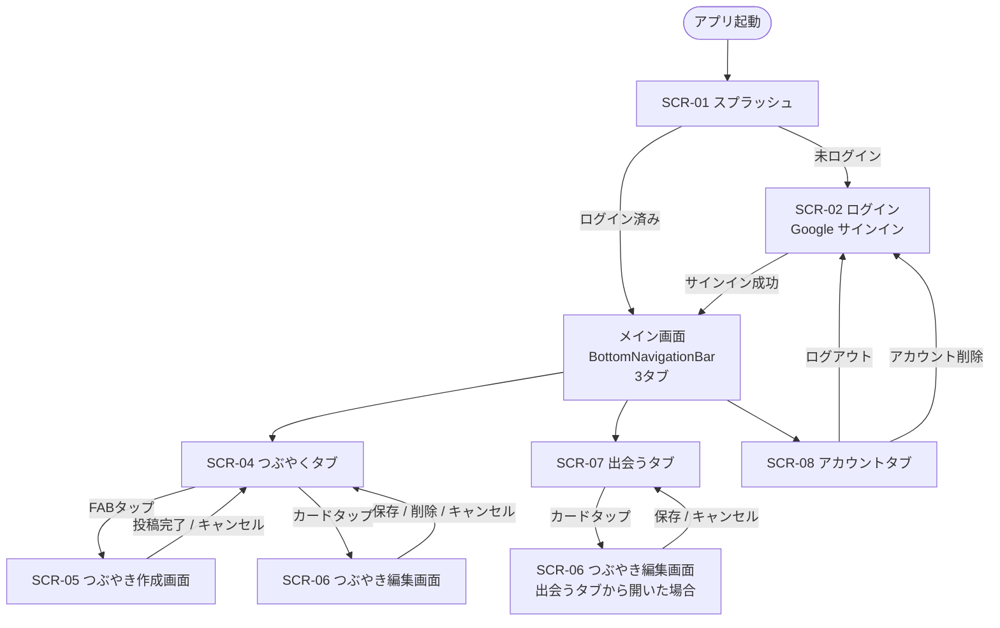

# 02. 基本設計書（外部設計）

## 1. 画面一覧

| 画面ID | 画面名 | 概要 |
|--------|--------|------|
| SCR-01 | スプラッシュ画面 | 起動時の認証状態確認・振り分け |
| SCR-02 | ログイン画面 | Google アカウントによるサインイン |
| SCR-04 | つぶやくタブ | つぶやき一覧（タイムライン形式）・検索・並べ替え |
| SCR-05 | つぶやき作成画面 | テキスト入力・投稿（上限 140 文字） |
| SCR-06 | つぶやき編集画面 | 既存つぶやきの上書き編集・削除 |
| SCR-07 | 出会うタブ | ランダム 3 件の過去つぶやき表示 |
| SCR-08 | アカウントタブ | ユーザー情報確認・ログアウト・CSV 送信・アカウント削除 |

---

## 2. 画面遷移図

---

## 3. 画面詳細

### SCR-02 ログイン画面

Google アカウントによるサインイン画面。ネットワーク未接続時はボタンを非活性にしてエラーメッセージを表示する。

### SCR-04 つぶやくタブ

| 要素 | 詳細 |
|------|------|
| ヘッダー | アプリタイトル（Thinkee）・並べ替えアイコン |
| 検索バー | キーワード入力でリアルタイムフィルタリング |
| つぶやきカード | テキスト・投稿日時を表示。編集済みの場合は編集日時を小さく併記。お気に入りボタン・引用ボタン付き。タップで編集画面へ |
| 引用カード | 通常カードの下部に引用元カードを小さく埋め込んで表示。引用元が削除済みの場合は「削除されたつぶやき」を表示 |
| FAB | 右下に配置。タップでつぶやき作成画面へ |
| 並べ替え / フィルター | 新しい順 / 古い順 の並べ替え＋お気に入りのみ表示フィルター |

### SCR-05 つぶやき作成画面

引用モードで開いた場合は、入力欄の下部に引用元カードをプレビュー表示する。

| 要素 | 詳細 |
|------|------|
| テキスト入力欄 | 複数行対応。キーボード表示時に自動スクロール |
| 引用元プレビュー | 引用モード時のみ表示。引用元の内容を小さく表示（読み取り専用） |
| 残り文字数カウンター | 「残り XX 文字」を表示（引用元テキストはカウント対象外）。上限超過時は赤字で警告 |
| 投稿ボタン | 入力が空、または 140 文字超の場合は非活性 |
| キャンセル | ナビゲーションバーの戻るボタン |

### SCR-06 つぶやき編集画面

| 要素 | 詳細 |
|------|------|
| テキスト入力欄 | 既存のつぶやき内容を初期表示 |
| 保存ボタン | 変更を Supabase に反映 |
| 削除ボタン | 確認ダイアログを経てつぶやきを削除（出会うタブから開いた場合は非表示） |

### SCR-07 出会うタブ

| 要素 | 詳細 |
|------|------|
| 日付ラベル | 「YYYY/MM/DD のつぶやき」形式で表示 |
| つぶやきカード × 3 | ランダムに選ばれた過去のつぶやきを表示。投稿日時・編集日時を小さく表示。お気に入りボタン・引用ボタン付き |
| つぶやきが 3 件未満の場合 | 「つぶやきが少ないです」旨のメッセージのみ表示し、カードは表示しない |

### SCR-08 アカウントタブ

| 要素 | 詳細 |
|------|------|
| ユーザー情報 | Google アカウント名・メールアドレスを表示 |
| CSV 送信ボタン | タップで確認ダイアログ表示後、登録メールアドレスに CSV を送信（Resend） |
| ログアウトボタン | タップで確認ダイアログ表示後、ログイン画面に遷移 |
| アカウント削除ボタン | タップで二重確認ダイアログ表示後、全データ削除してログイン画面に遷移 |

---

## 4. UI / UX ポリシー

| 項目 | 方針 |
|------|------|
| デザインシステム | **Material Design 3** を基本とする |
| プラットフォーム差異 | iOS では Cupertino スタイルのダイアログ、Android では Material ダイアログ を使い分ける（`showAdaptiveDialog` 利用） |
| テーマ | ライトモード・ダークモード対応（TBD：優先度は低） |
| ナビゲーション | `BottomNavigationBar`（3 タブ：つぶやく / 出会う / アカウント）+ `go_router` によるルーティング管理 |
| ローディング表示 | `AsyncValue` の `when` を使って全画面で一貫したローディング・エラー表示を行う |
| 操作フィードバック | 投稿・編集・削除の完了時は `SnackBar` でフィードバックを表示 |

---

## 5. データストア方針

| データ種別 | 保存先 | 理由 |
|-----------|--------|------|
| 投稿データ | Supabase（PostgreSQL） | 複数端末での同期・RLS によるセキュリティ確保 |
| 認証情報 | Supabase Auth（自動管理） | SDK が永続化を担う |
| 振り返りの最終更新日時 | SharedPreferences（端末ローカル） | 1 日 1 回の制御に使用。サーバー同期不要 |
| 振り返り表示中の 3 件 | Riverpod のメモリキャッシュ + SharedPreferences | アプリ再起動後も同日の内容を保持するため |
