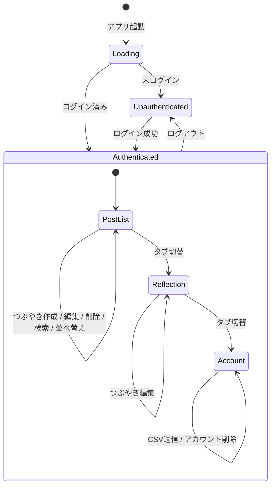
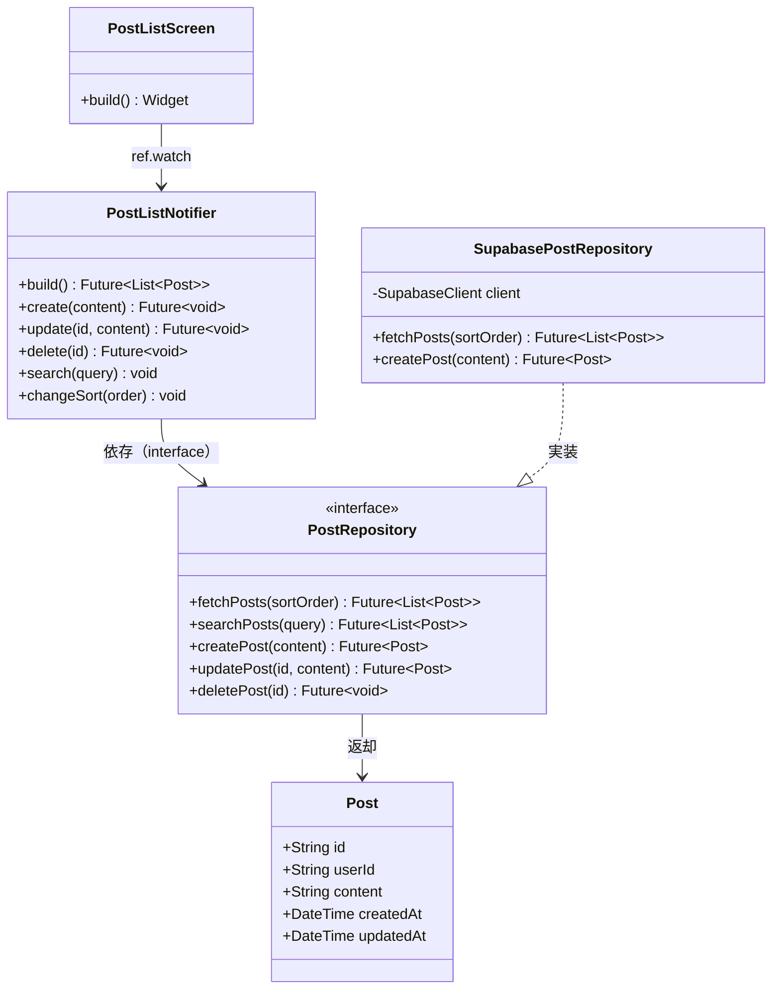

# 03. 詳細設計書（内部設計）

## 1. データモデル

### 1-1. Supabase（PostgreSQL）テーブル定義

#### `posts` テーブル

```sql
CREATE TABLE public.posts (
  id          UUID        PRIMARY KEY DEFAULT gen_random_uuid(),
  user_id     UUID        NOT NULL REFERENCES auth.users(id) ON DELETE CASCADE,
  content        TEXT        NOT NULL,
  is_favorited   BOOLEAN     NOT NULL DEFAULT false,
  quoted_post_id UUID        REFERENCES public.posts(id) ON DELETE SET NULL,
  created_at     TIMESTAMPTZ NOT NULL DEFAULT now(),
  updated_at     TIMESTAMPTZ NOT NULL DEFAULT now()
);

-- updated_at を自動更新するトリガー
CREATE OR REPLACE FUNCTION update_updated_at()
RETURNS TRIGGER AS $$
BEGIN
  NEW.updated_at = now();
  RETURN NEW;
END;
$$ LANGUAGE plpgsql;

CREATE TRIGGER posts_updated_at
  BEFORE UPDATE ON public.posts
  FOR EACH ROW EXECUTE FUNCTION update_updated_at();
```

| カラム | 型 | 制約 | 説明 |
|--------|-----|------|------|
| `id` | UUID | PK, DEFAULT | 投稿ID |
| `user_id` | UUID | NOT NULL, FK | 投稿者（auth.users.id） |
| `content` | TEXT | NOT NULL | 投稿テキスト |
| `is_favorited` | BOOLEAN | NOT NULL, DEFAULT false | お気に入りフラグ |
| `quoted_post_id` | UUID | FK, NULL 許容 | 引用元の投稿ID。引用元が削除されると NULL になる |
| `created_at` | TIMESTAMPTZ | NOT NULL | 作成日時 |
| `updated_at` | TIMESTAMPTZ | NOT NULL | 更新日時（自動更新） |

> **Note:** ユーザープロフィール情報（メールアドレス等）は Supabase Auth の `auth.users` テーブルが管理するため、アプリ側に `users` テーブルは作成しない。

---

### 1-2. Dart Entity（`freezed` 使用）

```dart
// features/post/domain/post.dart
@freezed
class Post with _$Post {
  const factory Post({
    required String id,
    required String userId,
    required String content,
    required bool isFavorited,
    String? quotedPostId,
    Post? quotedPost,         // JOIN で取得。引用元が削除済みの場合は null
    required DateTime createdAt,
    required DateTime updatedAt,
  }) = _Post;

  factory Post.fromJson(Map<String, dynamic> json) => _$PostFromJson(json);
}
```

---

## 2. Repository インターフェース定義

### PostRepository

```dart
// features/post/domain/post_repository.dart
abstract class PostRepository {
  Future<List<Post>> fetchPosts({required String sortOrder}); // 'asc' or 'desc'
  Future<List<Post>> searchPosts({required String query});
  Future<List<Post>> fetchRandomPosts({required int count});
  Future<Post> createPost({required String content});
  Future<Post> createQuote({required String content, required String quotedPostId});
  Future<Post> updatePost({required String id, required String content});
  Future<Post> toggleFavorite({required String id, required bool value});
  Future<void> deletePost({required String id});
}
```

---

## 3. Riverpod 状態管理設計

### 3-1. Provider 一覧

| Provider名 | 種別 | 説明 |
|-----------|------|------|
| `supabaseClientProvider` | `Provider` | Supabase クライアントのシングルトン |
| `authStateProvider` | `StreamProvider` | ログイン状態のストリーム |
| `postRepositoryProvider` | `Provider` | PostRepository の実装インスタンス |
| `postListProvider` | `AsyncNotifierProvider` | 投稿一覧・CRUD 操作・検索・並べ替えを管理 |

| `reflectionProvider` | `AsyncNotifierProvider` | ランダム 3 件の取得・1日1回更新ロジックを管理 |

### 3-2. PostListNotifier

```dart
// features/post/presentation/post_list_provider.dart
@riverpod
class PostListNotifier extends _$PostListNotifier {
  @override
  Future<List<Post>> build() async {
    return ref.read(postRepositoryProvider).fetchPosts(sortOrder: 'desc');
  }

  Future<void> create(String content) async { ... }
  Future<void> createQuote(String content, String quotedPostId) async { ... }
  Future<void> update(String id, String content) async { ... }
  Future<void> toggleFavorite(String id, bool value) async { ... }
  Future<void> delete(String id) async { ... }
  void changeSort(String order) { ... }
  void search(String query) { ... }
  void filterFavorites(bool onlyFavorites) { ... }
}
```

### 3-3. ReflectionNotifier

```dart
// features/reflection/presentation/reflection_provider.dart
@riverpod
class ReflectionNotifier extends _$ReflectionNotifier {
  @override
  Future<List<Post>> build() async {
    final prefs = await SharedPreferences.getInstance();
    final lastUpdated = prefs.getString('reflection_last_updated');
    final today = DateFormat('yyyy-MM-dd').format(DateTime.now());

    if (lastUpdated == today) {
      // キャッシュから復元（TBD: SharedPreferencesに保存した投稿IDから再取得）
      return _loadCached(prefs);
    }
    return _refresh(prefs, today);
  }

  Future<List<Post>> _refresh(SharedPreferences prefs, String today) async {
    final posts = await ref.read(postRepositoryProvider).fetchRandomPosts(count: 3);
    await prefs.setString('reflection_last_updated', today);
    // 取得した投稿IDをキャッシュ保存（TBD）
    return posts;
  }
}
```

### 3-4. 状態フロー図



---

## 4. モジュール・クラス設計（投稿機能を例に）



---

## 5. セキュリティ・RLS 設計

### Row Level Security ポリシー

```sql
-- posts テーブル RLS
ALTER TABLE public.posts ENABLE ROW LEVEL SECURITY;

-- SELECT: 自分の投稿のみ取得可能
CREATE POLICY "posts_select_own"
  ON public.posts FOR SELECT
  USING (auth.uid() = user_id);

-- INSERT: 自分の user_id でのみ挿入可能
CREATE POLICY "posts_insert_own"
  ON public.posts FOR INSERT
  WITH CHECK (auth.uid() = user_id);

-- UPDATE: 自分の投稿のみ更新可能
CREATE POLICY "posts_update_own"
  ON public.posts FOR UPDATE
  USING (auth.uid() = user_id);

-- DELETE: 自分の投稿のみ削除可能
CREATE POLICY "posts_delete_own"
  ON public.posts FOR DELETE
  USING (auth.uid() = user_id);

```

---

## 6. CSV 出力・メール送信設計

### 処理フロー

1. ユーザーがアカウントタブで「CSV を送信」をタップ
2. Flutter アプリが Supabase Edge Function を呼び出す（認証済みトークン付き）
3. Edge Function が `auth.uid()` を元に posts テーブルから全件取得
4. Edge Function が CSV を生成し、**Resend** を使用してユーザーのメールアドレスに送信

### CSV フォーマット

```csv
id,content,created_at,updated_at
"uuid-1","考えたこと1","2026-04-01T10:00:00Z","2026-04-01T10:00:00Z"
"uuid-2","考えたこと2","2026-04-02T09:00:00Z","2026-04-02T09:00:00Z"
```

---

## 7. 要確認事項（TBD）

| # | 項目 | 内容 |
|---|------|------|
| T-1 | 振り返りキャッシュ方式 | 再起動後も同日の 3 件を保持するための SharedPreferences への保存形式（投稿 ID リスト保存案） |
| T-2 | ランダム取得の SQL | `ORDER BY RANDOM()` でパフォーマンスが問題になる件数か確認 |
| T-3 | 削除時の振り返りへの影響 | 振り返り表示中の投稿が削除された場合の挙動 |
