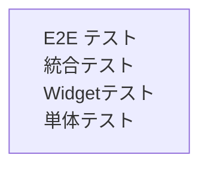

# 04. テスト方針・設計書

## 1. テスト戦略の概要

クリーンアーキテクチャの各層を独立してテスト可能な構造を活かし、以下の方針でテストを実施する。



| テスト種別 | 対象層 | 目的 |
|-----------|--------|------|
| 単体テスト（Unit Test） | Domain / Application（UseCase） | ビジネスロジックの正確性を検証 |
| Widget テスト | Presentation | UI コンポーネントの描画・操作を検証 |
| 統合テスト（Integration Test） | Infrastructure | Supabase との実際の通信を検証 |

---

## 2. 各層のテスト方針

### 2-1. Domain 層（単体テスト）

- **対象:** UseCase クラス、Entity のバリデーションロジック
- **方針:** Repository は `Mockito` または Riverpod のオーバーライドでモック化し、純粋な Dart ロジックとして実行する
- **実行速度:** 高速（外部依存なし）

```dart
// 例: CreatePostUseCase のテスト
void main() {
  late MockPostRepository mockRepository;
  late CreatePostUseCase useCase;

  setUp(() {
    mockRepository = MockPostRepository();
    useCase = CreatePostUseCase(mockRepository);
  });

  test('空のコンテンツでは投稿できないこと', () async {
    expect(
      () => useCase.execute(content: ''),
      throwsA(isA<ValidationException>()),
    );
  });
}
```

### 2-2. Presentation 層（Widget テスト）

- **対象:** 各画面 Widget、カスタム Widget コンポーネント
- **方針:** `ProviderContainer` を使い、Repository のモックデータを注入する。Riverpod の `overrides` 機能を活用する
- **実行速度:** 中速（Flutter テストランナーが必要）

```dart
// 例: 投稿一覧画面のテスト
void main() {
  testWidgets('投稿が空の場合、空状態メッセージが表示されること', (tester) async {
    await tester.pumpWidget(
      ProviderScope(
        overrides: [
          postListProvider.overrideWith(() => MockPostListNotifier([])),
        ],
        child: const MaterialApp(home: PostListScreen()),
      ),
    );
    expect(find.text('まだ投稿がありません'), findsOneWidget);
  });
}
```

### 2-3. Infrastructure 層（統合テスト）

- **対象:** `SupabasePostRepository` の各メソッド
- **方針:** Supabase のテスト用プロジェクトまたはローカル環境（Supabase CLI）に接続し、実際のクエリを実行する
- **実行速度:** 低速（外部通信が発生）

| テストケース | 内容 |
|-------------|------|
| `fetchPosts` | 投稿一覧が降順・昇順で正しく取得できること |
| `createPost` | 投稿が作成され、DB に保存されること |
| `updatePost` | `updated_at` が更新されること |
| `deletePost` | 投稿が DB から削除されること |
| `fetchRandomPosts` | 3 件取得でき、毎回異なる組み合わせになること（確率的） |
| `createQuote` | 引用つぶやきが作成され、`quoted_post_id` が正しく保存されること |
| `fetchPosts`（引用含む） | 引用つぶやきの取得時に引用元データが JOIN されて返ること |
| 引用元削除 | 引用元を削除したとき、引用カードの `quoted_post_id` が NULL になること |
| RLS 確認 | 他ユーザーのつぶやきが取得できないこと |

---

## 3. モック化方針

| 方法 | 用途 |
|------|------|
| Riverpod `overrides` | Presentation 層の Widget テストで Repository をモック化 |
| `mockito` パッケージ | UseCase / Repository の単体テストでのモック生成 |
| Supabase CLI ローカル環境 | Infrastructure 層の統合テスト用 DB |

```dart
// Riverpod overrides の例
ProviderScope(
  overrides: [
    postRepositoryProvider.overrideWithValue(MockPostRepository()),
  ],
  child: MyApp(),
)
```

---

## 4. テストカバレッジ方針

| 優先度 | 対象 |
|--------|------|
| 高 | UseCase（ビジネスロジック）・RLS ポリシー |
| 中 | Repository 実装・主要な Widget（つぶやき一覧、出会うタブ） |
| 低 | 画面遷移・UI のスタイル確認 |

---

## 5. 要確認事項（TBD）

| # | 項目 | 内容 |
|---|------|------|
| T-1 | Supabase ローカル環境 | 統合テスト用に Supabase CLI のローカル環境を構築するか |
| T-2 | CI へのテスト組み込み | GitHub Actions でのテスト自動実行の要否 |
| T-3 | E2E テスト | `flutter_driver` または `patrol` による E2E テストの要否 |
